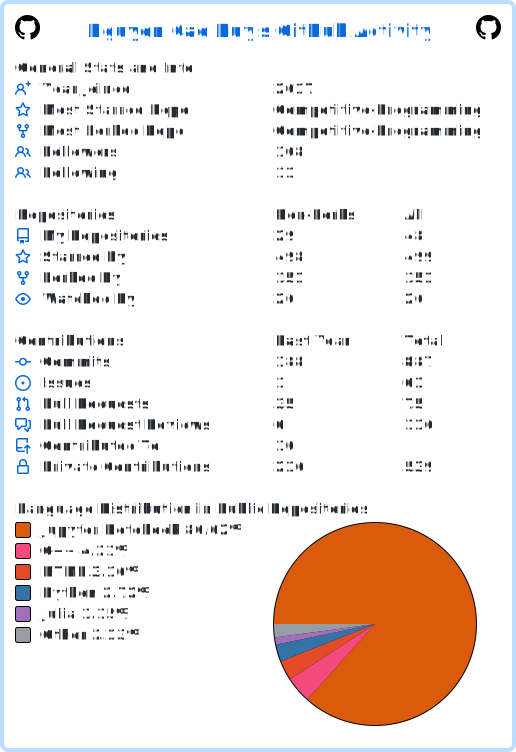

# Hello, world! I'm Duy! 👋 

I'm currently doing a double degree in Computer Science (CS) and Data Science & Analytics (DSA) at the National University of Singapore.

## Contacts

Feel free to reach me for any personal or professional opportunities!

## GitHub Statistics

